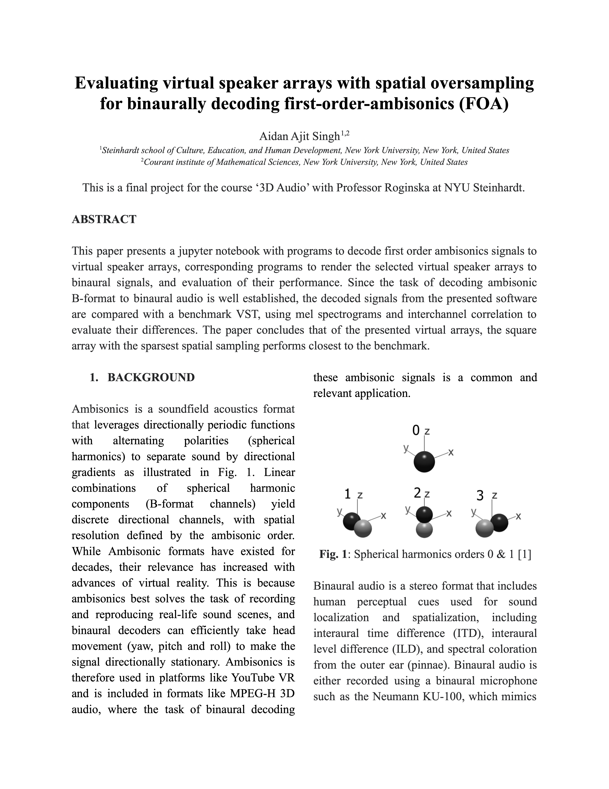
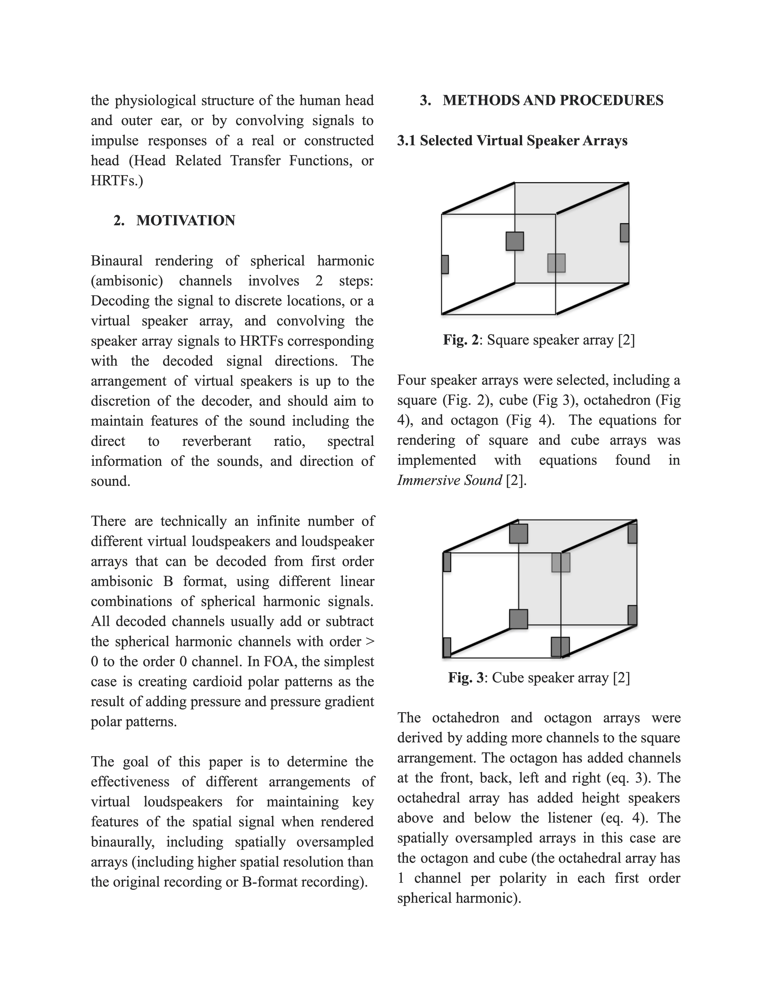
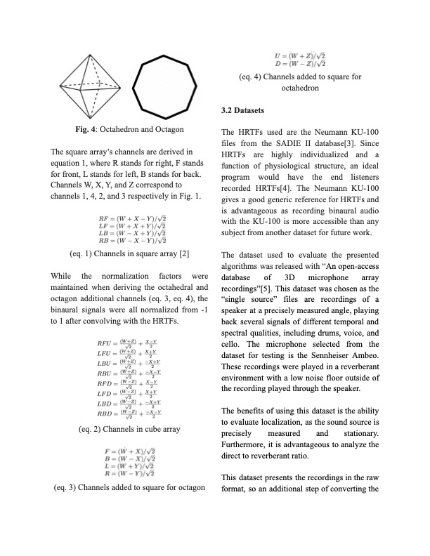
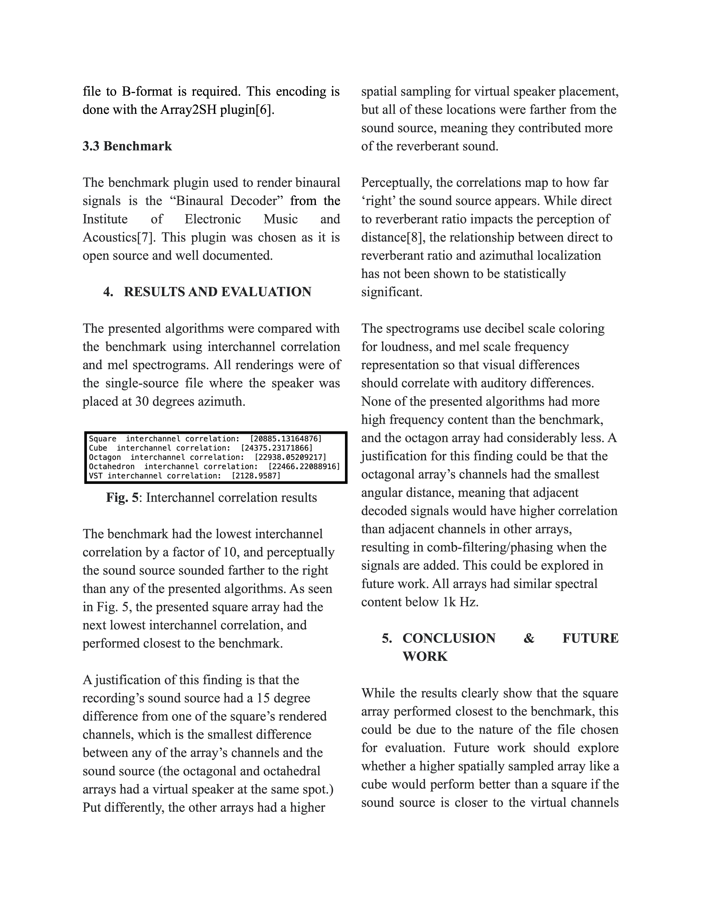
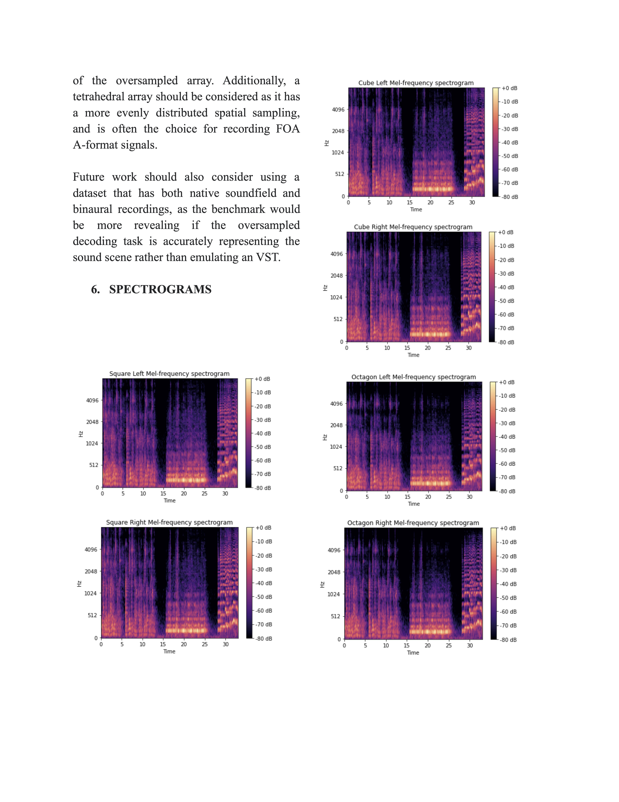
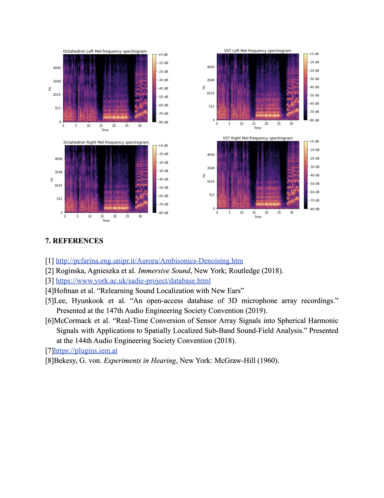

| [Homepage](https://aidanasingh.github.io) | [**Projects**](https://aidanasingh.github.io/Projects/) | [Music](https://aidanasingh.github.io/published_music/) | [Experience](https://aidanasingh.github.io/experience/) | 

# Binaurally decoding first order ambisonics

This is my final project for the course '3D Audio' in the Music Technology department at NYU.

[This project](https://github.com/aidanasingh/foa_decoding) includes a jupyter notebook with functions to render virtual speaker array channels, and associated functions that render these channels to a binaural stereo signal. 

## Paper

