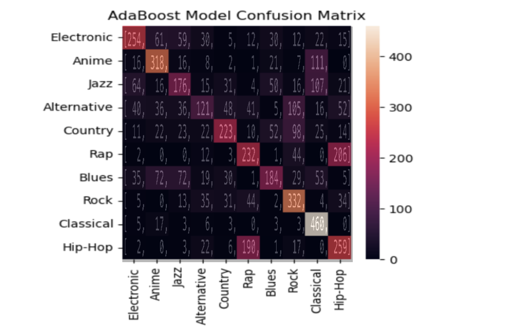
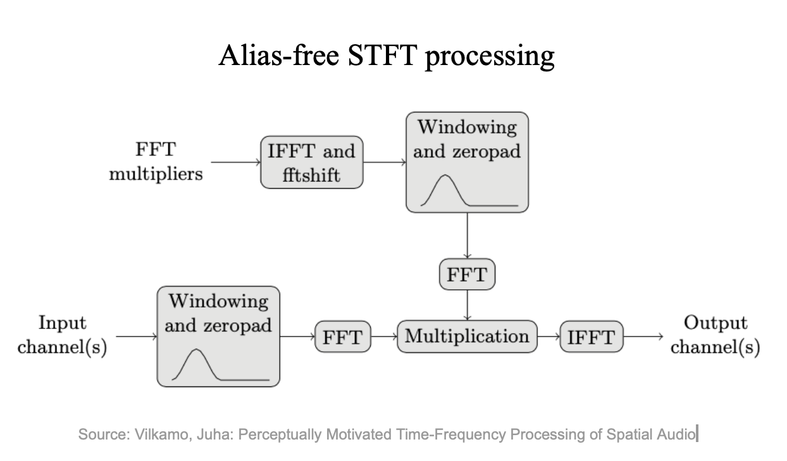
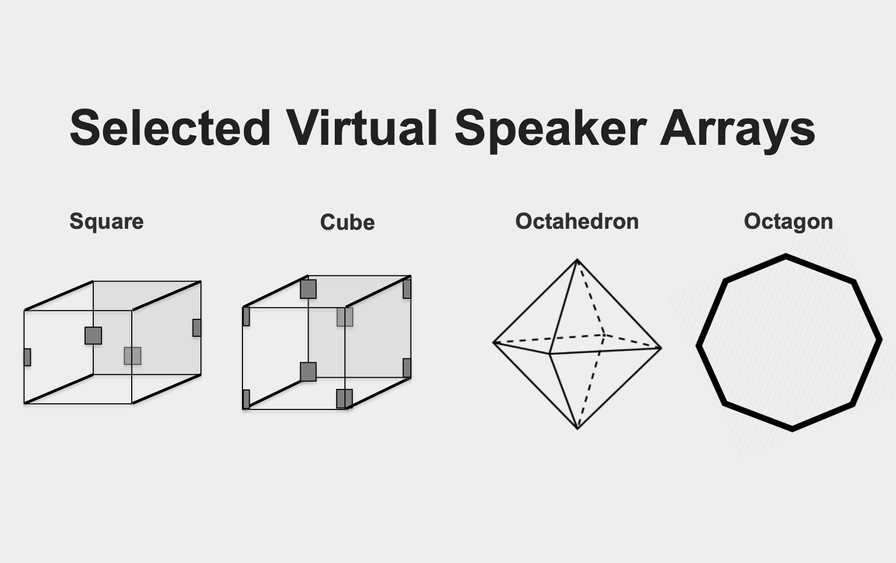

| [Homepage](https://aidanasingh.github.io) | [**Projects**](https://aidanasingh.github.io/Projects/) | [Music](https://aidanasingh.github.io/published_music/) | [Experience](https://aidanasingh.github.io/experience/) | 

[Predicting Song Genre with Spotify Metadata](genre_prediction)

[afSTFT Python Implementation](afSTFT) (In progress)

[Ambisonics Encoder](reu_encoder)

[Ambisonics Binaural Decoding](foa_binaural_decoder)

[Sampler Automation](arduino_sampler)

