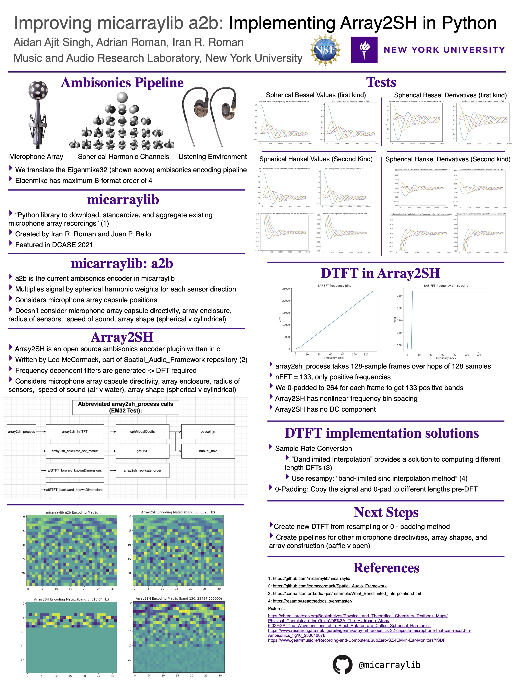

| [Homepage](https://aidanasingh.github.io) | [**Projects**](https://aidanasingh.github.io/Projects/) | [Music](https://aidanasingh.github.io/published_music/) | [Experience](https://aidanasingh.github.io/experience/) | 

# Ambisonics Encoder

## Motivation

Ambisonics is a multichannel audio format that provides a solution to storing the directionality of audio irrespective of the equipment used for recording or playback. For this reason, it shows promise in the field of machine listening, where computers are being trained to localize and label objects in space from sound with deep learning. Ambisonics leverages a standardized format that can be encoded from any microphone array recording, though encoders are often proprietary and have different functionality, making data standardization difficult when audio is presented in the raw recorded form.

## Task

To take microphone array datasets and convert them to ambisonic spherical harmonic channels, I pursued coding an encoder that takes features of the microphone array as arguments rather than being array-specific. Since this encoding problem was previously solved for in the context of audio plug-ins by Leo McCormack with Array2SH, my contribution is translating his code to python for dataset aggregation.

## Outcomes

[My code](https://github.com/aidanasingh/micarraylib/blob/4a359b3a49d625c9d5bf6e6ccb9183ad73388d3c/micarraylib/utils.py#L33-L277) produces the encoding matrix for an eigenmike32, but further work is needed to compute the time-frequency representation of the input signal, which in Array2SH is a combination of Discrete Fourier Transforms and Discrete Cosine Transforms at different time windows.

I am pursuing implementing this time-frequency transform ("afSTFT" by Juha Vilkamo) for my senior capstone project under Dr. Brian McFee.

## Poster

I explored this topic through my NSF REU position (National Science Foundation Research Experiences for Undergrads) at the NYU Music and Audio Research Laboratory under Dr. Iran Roman.