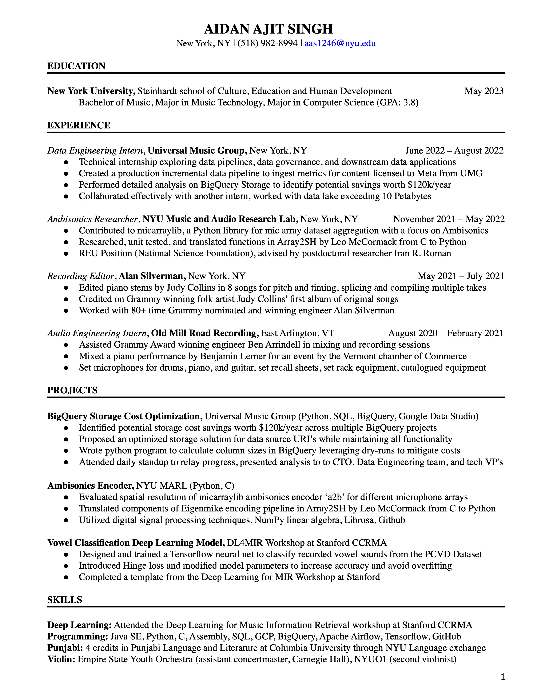

| [Homepage](https://aidanasingh.github.io) | [Projects](https://aidanasingh.github.io/Projects/) | [Music](https://aidanasingh.github.io/published_music/) | [Experience](https://aidanasingh.github.io/experience/) | 

# Resume

# Select Coursework

### Introduction to Digital Signal Theory

Graduate course in the department of Music Technology. Theoretical class overviewing sampling theory, time & frequency domain convolution, FIR & IIR filtering, and DFT, FFT, & STFT algorithms. Practical lab portion taught in python.

### Audio Streaming Technology

Graduate course in the department of Music Technology. Practical class taught in c/c++, overviewing all portions of an audio live streaming pipeline including compression/perceptually motivated encoding, filterbanks, internetworking (client, source client, and server relationships, TCP protocol), and buffering.

### 3D Audio

Graduate course in the department of Music Technology. Theoretical class overviewing the psychoacoustics and perception of sound localization and spatialization, and audio formats including channel based audio, binaural audio, object based audio, and soundfield/ambisonics.

## Other Relevant Coursework

Data Structures, Algorithms, Computer Systems Organization, Operating Systems, Linear Algebra, Calculus I & II, Physics E&M, Physics Mechanics