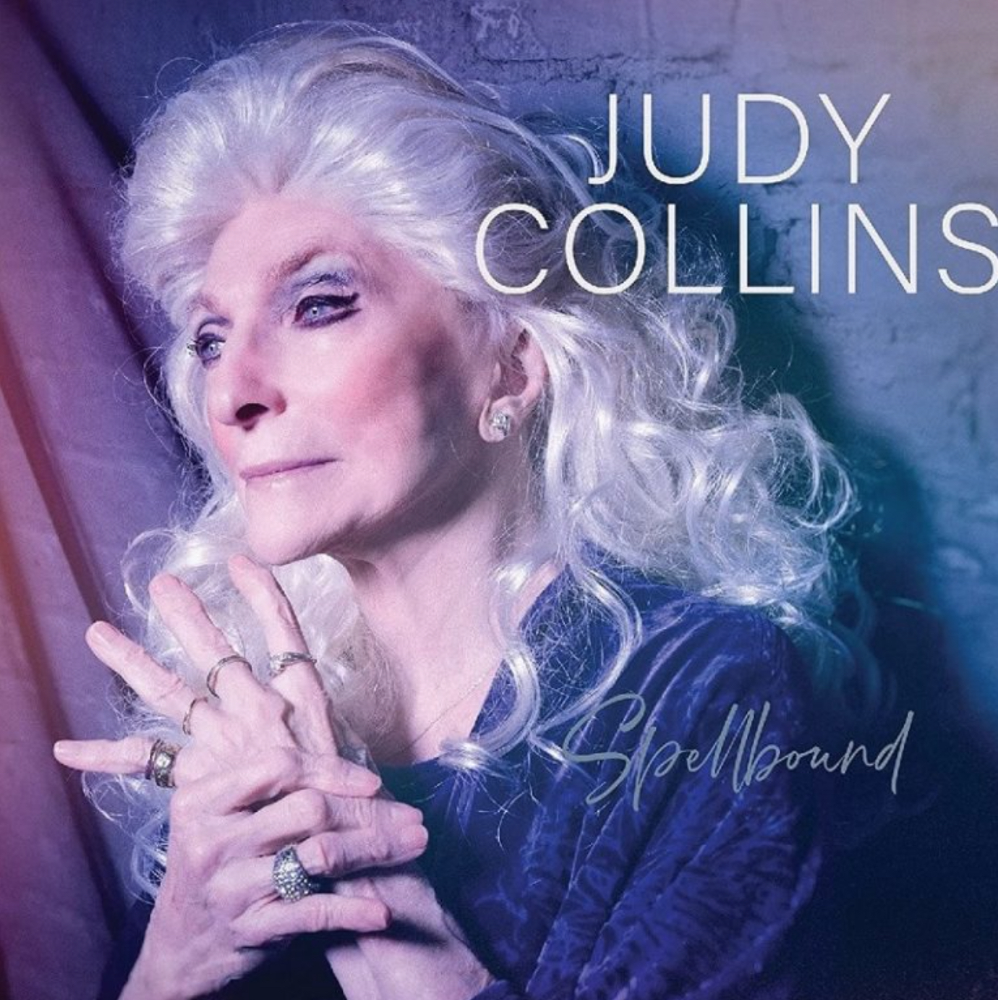
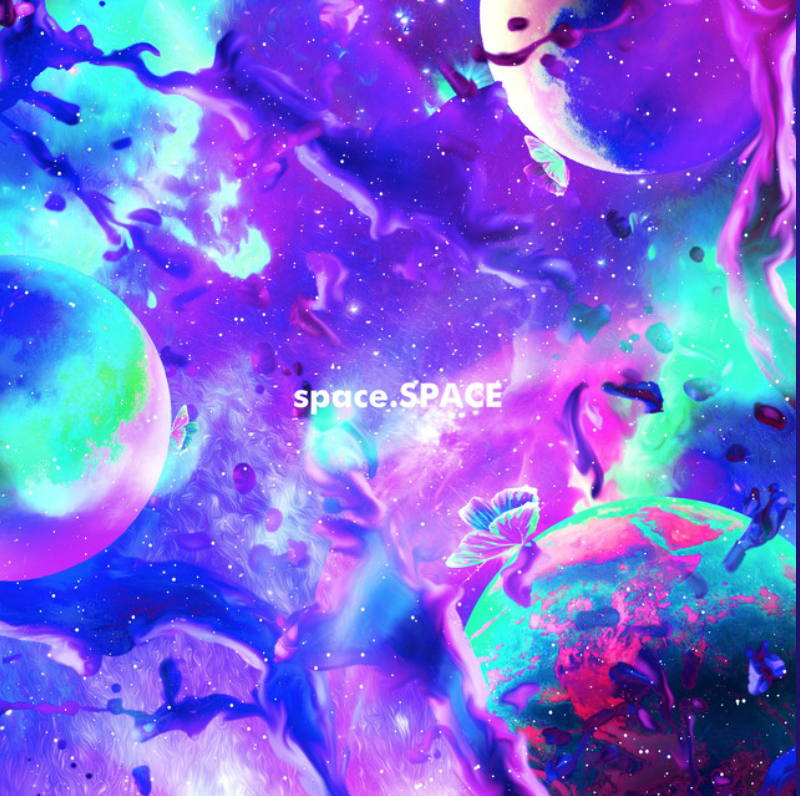
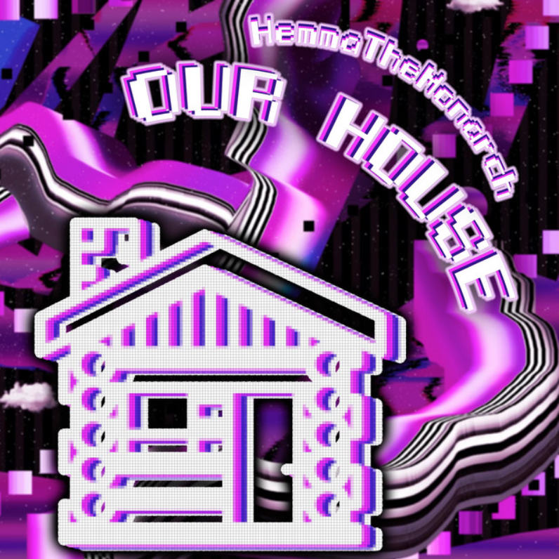
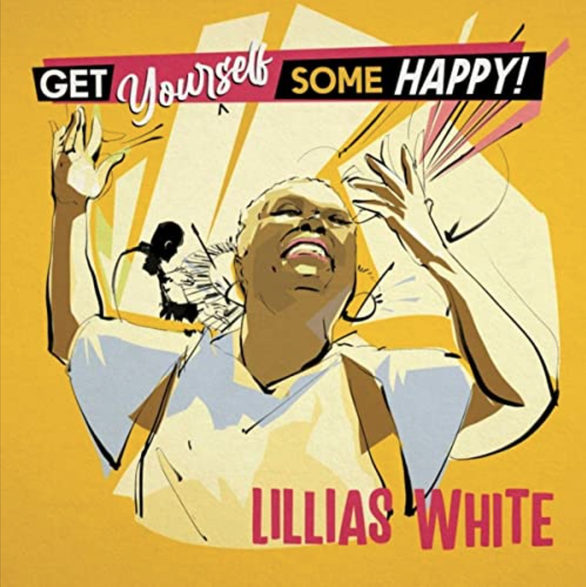

| [Homepage](https://aidanasingh.github.io) | [Projects](https://aidanasingh.github.io/Projects/) | [Music](https://aidanasingh.github.io/published_music/) | [Experience](https://aidanasingh.github.io/experience/) | 

# Published Music

### **Spellbound** Judy Collins

Credited as Music Editor for the Album

___

### **Space Between Spaces** Hemma The Monarch

Credited as Producer on tracks DRT, Pt. 1 & DRT, Pt. 2

___

### **Our House** Hemma The Monarch

Credited as Producer for the Single

___

### **Get Yourself Some Happy** Lillias White

Credited as String Arranger for the Album

